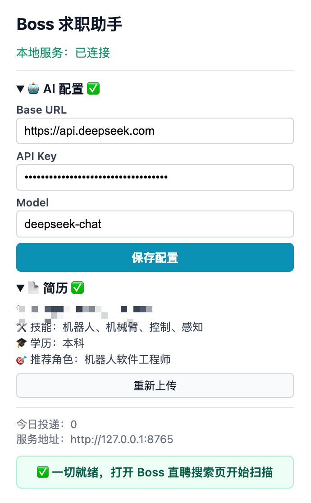
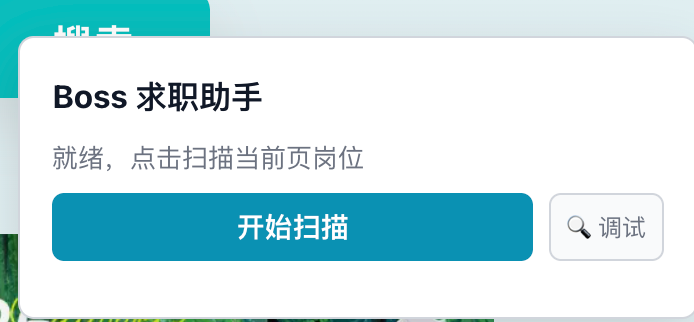
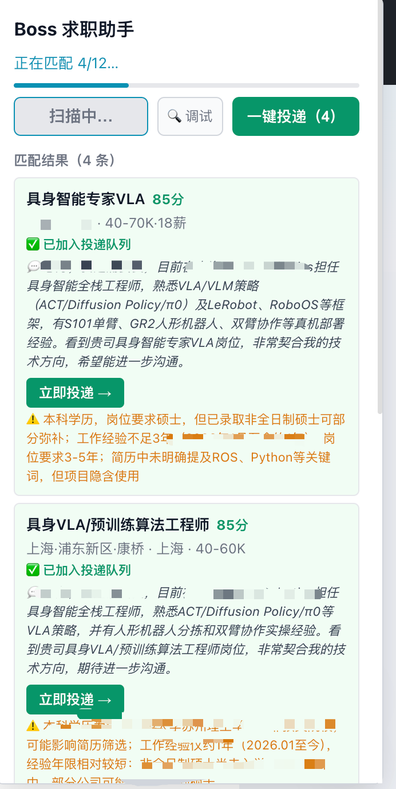

# Boss 求职助手

一个面向 Boss 直聘网页的本地求职辅助工具。项目由 Chrome/Edge 浏览器扩展和本地 FastAPI 服务组成，可以解析简历、扫描当前搜索结果页岗位、调用兼容 OpenAI Chat Completions 的模型生成匹配结果和打招呼语，并在用户触发后按队列逐个打开岗位详情页辅助沟通。

> 仅供个人学习和自用自动化研究。请遵守招聘网站服务条款、平台风控规则和当地法律法规。

## 截图

### 配置与服务状态



### 页面浮动面板



### 扫描与投递队列



## 功能

- 扫描 Boss 直聘搜索结果页中的岗位卡片。
- 支持 Boss 页面新版/旧版卡片结构和部分私有字体薪资数字解析。
- 上传并解析 PDF/DOCX 简历。
- 使用云端 AI 基于“简历 + 岗位 JD”生成匹配评分、风险提示和打招呼语。
- 在岗位详情页重新读取完整 JD，并再次生成更贴合当前岗位的招呼语。
- 一键建立投递队列，逐个打开岗位详情页并尝试自动沟通。
- 遇到验证码、人机验证、登录异常、账号异常或未知页面结构时暂停。
- 本地服务运行在 `127.0.0.1:8765`，简历解析和队列数据优先保留在本机。

## 安全边界

本项目不会，也不应被用于：

- 绕过验证码、人机验证、登录校验或账号风控。
- 隐藏浏览器指纹、伪装设备或规避平台反自动化机制。
- 无限量批量投递或对招聘方造成骚扰。
- 访问未登录用户不可见、非当前账号授权的数据。

扩展只操作当前浏览器中用户已登录可见的 Boss 直聘页面。自动化流程遇到异常页面时应停止，由用户手动处理。

## 项目结构

```text
.
├── apps
│   ├── extension          # Chrome/Edge Manifest V3 扩展
│   └── local-service      # 本地 FastAPI 服务：简历解析、AI 匹配、队列模型
├── packages
│   └── shared-schema      # 前后端共享 TypeScript 数据契约
└── docs                   # 设计文档与开发 runbook
```

## 技术栈

- Extension: React, TypeScript, Vite, Manifest V3, Vitest
- Local service: FastAPI, Pydantic, httpx, pypdf, python-docx, pytest
- AI: 兼容 OpenAI Chat Completions 的接口，例如 DeepSeek、OpenAI 或其他兼容服务

## 环境要求

- Node.js 20+ 推荐
- Python 3.11+
- Chrome 或 Edge
- 一个兼容 OpenAI Chat Completions 的 API Key

## 安装

安装前端依赖：

```bash
npm install
```

安装本地服务依赖：

```bash
cd apps/local-service
python -m pip install -e ".[test]"
```

如果你使用 Conda，可以先创建并激活环境：

```bash
conda env create -f environment.yml
conda activate job-apply-assistant
```

## 启动本地服务

从 `apps/local-service` 目录启动：

```bash
python -m uvicorn job_apply_assistant.main:app --host 127.0.0.1 --port 8765
```

健康检查：

```bash
curl http://127.0.0.1:8765/health
```

期望返回：

```json
{"status":"ok","service":"job-apply-assistant-local-service"}
```

## 构建并加载扩展

构建扩展：

```bash
npm --workspace apps/extension run build
```

在 Chrome/Edge 中加载：

1. 打开 `chrome://extensions` 或 `edge://extensions`。
2. 开启“开发者模式”。
3. 点击“加载已解压的扩展程序”。
4. 选择 `apps/extension/dist`。
5. 修改代码并重新 build 后，需要在扩展管理页点击“重新加载”。

## 配置

点击浏览器工具栏中的扩展图标，完成：

1. 配置 AI：
   - `baseUrl`：例如 `https://api.deepseek.com` 或 OpenAI 兼容地址。
   - `apiKey`：你的 API Key。
   - `model`：例如 `deepseek-chat`。
2. 上传 PDF/DOCX 简历。
3. 设置偏好，例如城市、关键词、每日上限、间隔和工作时间段。

注意：AI 请求会把简历结构化内容和岗位 JD 发送给你配置的模型服务。请确认你信任该服务，并理解相关隐私与费用风险。

## 使用流程

1. 确保本地服务正在运行。
2. 登录 Boss 直聘。
3. 打开 Boss 直聘岗位搜索结果页。
4. 点击页面右侧的“Boss 求职助手”浮动面板中的“开始扫描”。
5. 扫描完成后检查匹配结果、风险提示和招呼语。
6. 点击“立即投递”或“一键投递”。
7. 扩展会建立队列，逐个打开岗位详情页：
   - 读取详情页完整 JD。
   - 再次调用 AI 生成更贴合的打招呼语。
   - 点击沟通按钮。
   - 尝试把生成语填入聊天输入框并发送。
8. 如果出现验证码、登录失效、账号异常、弹窗或页面结构变化，请手动处理后重新扫描。

Boss 直聘可能会在点击沟通时自动发送平台默认招呼语。扩展无法阻止平台服务端先发送这条默认消息，但会继续尝试发送 AI 根据简历和 JD 生成的补充消息。

## 开发命令

运行扩展测试：

```bash
npm --workspace apps/extension test
```

扩展类型检查：

```bash
npm --workspace apps/extension run lint
```

构建扩展：

```bash
npm --workspace apps/extension run build
```

运行本地服务测试：

```bash
cd apps/local-service
python -m pytest -q
```

根目录工作区测试：

```bash
npm test
```

更多开发说明见 [docs/dev-runbook.md](docs/dev-runbook.md)。

## 常见问题

### 本地服务未连接

确认服务在 `127.0.0.1:8765` 运行：

```bash
curl http://127.0.0.1:8765/health
```

如果没有返回 `status: ok`，重新启动本地服务。

### 修改代码后页面没变化

重新构建扩展，然后在 `chrome://extensions` 里点击扩展的“重新加载”，最后刷新 Boss 页面。

### 扫描不到岗位

确认当前页面是 Boss 直聘岗位搜索结果页，并且账号已登录。Boss 页面结构变化时可能需要更新 `apps/extension/src/content/bossAdapter.ts`。

### 一键投递后没有继续

查看页面顶部状态条。扩展会显示当前步骤，例如正在读取任务、正在生成招呼语、正在点击沟通、未找到按钮等。遇到验证码、登录失效或弹窗时请手动处理。

### 为什么会看到 Boss 默认招呼语

Boss 直聘可能在点击“立即沟通/继续沟通”后自动发送平台默认消息。扩展无法阻止这条服务端默认消息，只能在聊天框出现后继续发送 AI 生成的消息。

## 隐私说明

- 简历文件由本地 FastAPI 服务解析。
- 上传后的结构化简历数据保存在浏览器扩展存储中，用于匹配和生成招呼语。
- AI 生成阶段会把简历内容、偏好和岗位 JD 发送到你配置的 AI 服务。
- API Key 保存在浏览器扩展存储中，请勿在公共电脑上使用。

## 免责声明

本项目是个人求职辅助和浏览器自动化学习项目，不保证适配 Boss 直聘未来页面结构，也不保证投递成功率。使用者应自行承担账号风控、平台规则、隐私和费用风险。

## License

如果要开源发布，建议在仓库中补充明确的 `LICENSE` 文件。
